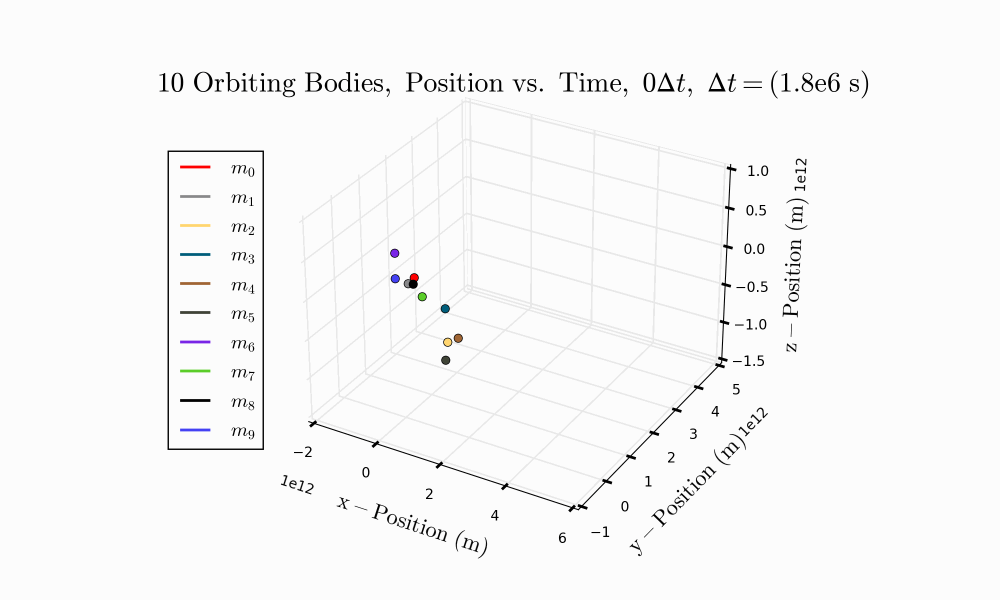
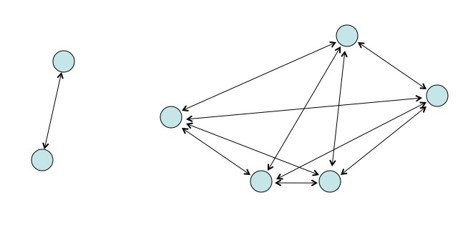
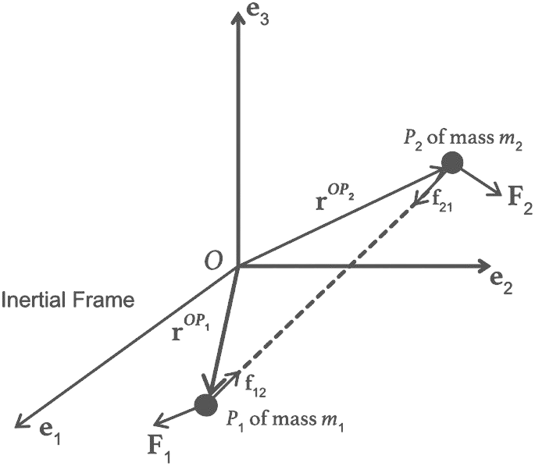
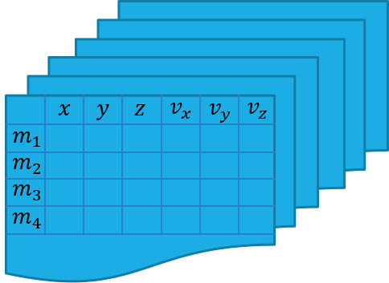
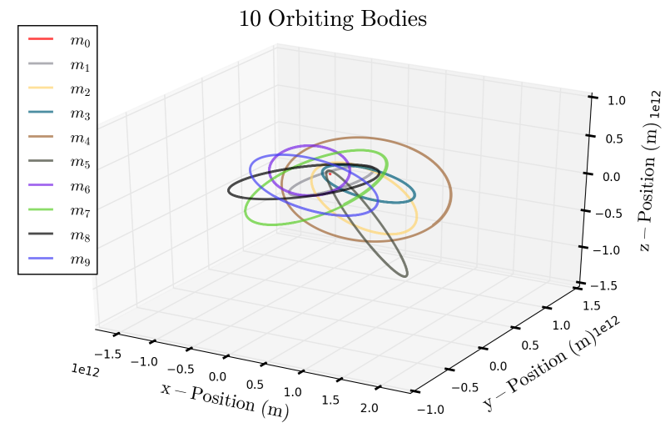
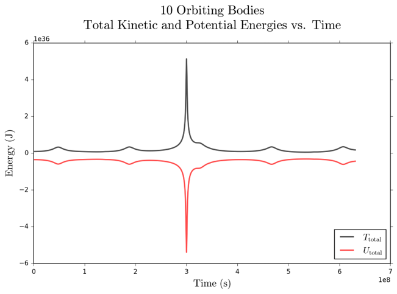
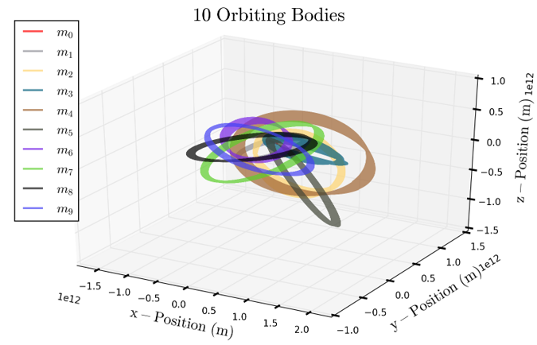
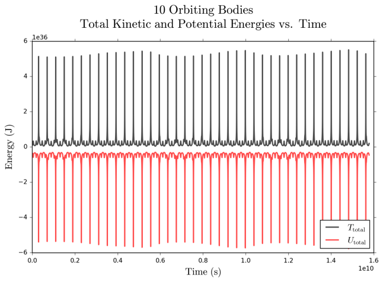

# Norbit
## Solving the [N-Body Problem](https://en.wikipedia.org/wiki/N-body_problem) with Numerical Simulations
Explore gravitational $n$-body simulations with Norbit, a numerical solution to the [$n$-body problem](https://en.wikipedia.org/wiki/N-body_problem). Norbit enables you to set up an orbital system with any number of bodies and observe how their orbits evolve over time.

  

<!-- TOC start (generated with https://github.com/derlin/bitdowntoc) -->

- [Norbit](#norbit)
  - [Solving the N-Body Problem with Numerical Simulations](#solving-the-n-body-problem-with-numerical-simulations)
- [1. Introduction](#1-introduction)
  - [1.1 What is the $n$-body problem?](#11-what-is-the-n-body-problem)
  - [1.2 What makes it so difficult?](#12-what-makes-it-so-difficult)
    - [1.2.1 Accounting for Warped Spacetime](#121-accounting-for-warped-spacetime)
- [2. Mathematical Formalism](#2-mathematical-formalism)
  - [2.1 Formal Problem Statement](#21-formal-problem-statement)
  - [2.2 Strategy](#22-strategy)
  - [2.3 Using Multidimensional Arrays](#23-using-multidimensional-arrays)
  - [2.3 Numerical Implementation](#23-numerical-implementation)
- [3. Core Files](#3-core-files)
  - [3.1 `simulate_orbits.py`](#31-simulate_orbitspy)
  - [3.2 `config.yaml`](#32-configyaml)
  - [3.3 `animator.py`](#33-animatorpy)
  - [3.4 `orbiter.py`](#34-orbiterpy)
  - [3.5 `plotter.py`](#35-plotterpy)
- [4. 10-Body Investigation](#4-10-body-investigation)
  - [5. Appendix: Setup for New Developers](#5-appendix-setup-for-new-developers)

<!-- TOC end -->

<!-- TOC -->
# 1. Introduction
<!-- TOC -->
## 1.1 What is the $n$-body problem?

In physics, the $n$-body problem is about predicting the motions of celestial objects interacting via gravity. It’s essential for understanding the orbits of bodies like the Sun, Moon, and planets. In the 20th century, as astronomers discovered more orbiting bodies in the universe, the desire to solve this problem intensified, but a complete analytical solution remains elusive to this day.

  

    <em>These twenty beautiful examples of the 3-body problem from Wikipedia are an infinitesimally small subset of the n-body solution space.</em>

<!-- TOC -->
## 1.2 What makes it so difficult?
Solving the $n$-body problem is notoriously difficult because the gravitational interactions between each pair of objects create a highly complex, non-linear system of differential equations that cannot be solved analytically for $N>2$. Additionally, the problem's sensitivity to initial conditions, known as chaos, makes long-term predictions highly sensitive to even the smallest perturbations.

  

<!-- TOC -->
### 1.2.1 Accounting for Warped Spacetime
Then, to make things even *harder*, a truly complete physical solution needs to include general relativity to account time and space distortions. Despite this, the two-body problem and the three-body problem (with restrictions) have been fully solved. **Norbit's simulations do not account for warped spacetime.**

<!-- TOC -->
# 2. Mathematical Formalism

  

<!-- TOC -->
## 2.1 Formal Problem Statement
Simply put, the problem is:
  >**Given the current position, velocity, and time of celestial bodies, calculate their gravitational interactions and predict their future motions.**
<!-- TOC -->
## 2.2 Strategy
We must solve Newton's equations of motion for $n$ separate bodies in 3D. Given a set of positions, the equation below shows how to obtain the 3D acceleration experienced by body $i$ in the presence of $j$ other bodies.

$$\mathbf{a}_{ij}=\sum_{\stackrel{j\neq i}{j=1}}^{N}\frac{Gm_{j}\left(\mathbf{r}_{j}-\mathbf{r}_{i}\right)}{\left\Vert \mathbf{r}_{j}-\mathbf{r}_{i}\right\Vert ^{3}}$$

The accelerations are integrated to find velocities, and then the velocities are integrated to find positions.

$$U=-\sum_{1\leq i\leq j\leq n}\frac{Gm_{i}m_{j}}{\left\Vert \mathbf{r}_{j}-\mathbf{r}_{i}\right\Vert }$$

The positions enable the calculation of potential energies while the velocities corresponding to kinetic energies.

<!-- TOC -->
## 2.3 Using Multidimensional Arrays
Norbit approaches this problem using matrix algebra, enabled by multidimensional arrays, and facilitated by `pandas` and `numpy`. Think of each moment in time as a layer in a large stack. Each moment is a snapshot of six critical numbers associated with each orbiting body, exactly at that moment: $x$-position, $y$-position, $z$-position, $x$-velocity, $y$-velocity, and $z$-velocity.

  

<!-- TOC -->
## 2.3 Numerical Implementation
We need to *step* the simulation through time, and the lower the step size, the more accurate the simulation. Step size is not the only important factor though. Using different stepping *methods* can drastically improve the precision of the orbital trajectory calculations. The methods Norbit employs are listed here in ascending order of precision. Refer to `orbiter.Orbiter` to review the actual algorithms.
  1. Euler
  2. Euler-Cromer
  3. Second-Order Runge-Kutta
  4. Fourth-Order Runge-Kutta
  5. Velocity Verlet
  6. Position Verlet
  7. Velocity Extended Forest-Ruth-Like
  8. Position Extended Forest-Ruth-Like

<!-- TOC -->
# 3. Core Files
<!-- TOC -->
## 3.1 [`simulate_orbits.py`](simulate_orbits.py)
Run `python simulate_orbits.py` to interface with this project. `config.yaml` directs this script on whether to run a new simulation, load an old one, plot results, or transform results into an animated GIF.

<!-- TOC -->
## 3.2 [`config.yaml`](configs/config.yaml)
Define how the script should run. Many of the options are self-explanatory, but if you need clarification, refer to the `Simulator` class in `simulate_orbits.py`. Look to `config.yaml` for a concrete example.

<!-- TOC -->
## 3.3 [`animator.py`](norbit/animator.py)
Animate 3D orbital trajectories with the `Animator` class, given a solved orbital system.

<!-- TOC -->
## 3.4 [`orbiter.py`](norbit/orbiter.py)
Calculate (i.e. solve for) 3D orbital trajectories with the `Orbiter` class.

<!-- TOC -->
## 3.5 [`plotter.py`](norbit/plotter.py)
Plot 3D orbital trajectories with the `Plotter` class, given a solved orbital system.

<!-- TOC -->
# 4. 10-Body Investigation
Here we compare the results of a 25-year simulation and a 500-year simulation of an orbital system similar to our solar system using the Euler method. Because of the method's in-built imprecision, notice how the orbits "smear" over long periods of time, indicating energy loss in the system.

  

  

  

  

<!-- TOC -->
## 5. Appendix: Setup for New Developers
If you are fairly new to Python programming, I'd recommend the setting up this project by following these steps. If you want more in depth knowledge about environment setup, I'd recommend you read [my tutorial on interfacing with the computer like a software developer](https://github.com/cemenenkoff/python-essentials-for-stem-wizards).

1. Download and install [VS Code](https://code.visualstudio.com/download).

2. Install [Python 3.12.4](https://www.python.org/downloads/release/python-3124/) (☑️ **Add python.exe to PATH** if you have no other Python versions installed).

3. Install [Git bash](https://git-scm.com/downloads).

4. Open VS Code.

5. Press `F1`, and in the command palette, search for `Terminal: Select Default Profile` and set Git bash as the default terminal.

6. Start a new terminal with `Ctrl` + `` ` ``.

7. Clone this repository to a directory where you like to store your coding projects.

8. Open this repository (i.e. the `norbit` folder) as the current workspace folder with `Ctrl` + `K` `Ctrl` + `O`.

9.  Make sure the terminal path points to the `norbit` folder, and if it doesn't, navigate there via `cd <path_to_norbit_folder>`. You can confirm you're in the right spot with quick `ls -la` command.

10. From the terminal, run `pip install virtualenv` to install the `virtualenv` module.

11. Run `python -m virtualenv <myenvname> --python=python3.12.4` to create a virtual environment that runs on Python 3.12.4.

12. Activate the virtual environment with `source <myenvname>/bin/activate`.

13. You should see `(<myenvname>)` two lines above the terminal input line when the environment is active.

14. Press `F1` to open VS Code's command palette, then search for `Python: Select Interpreter` and select `Python 3.12.4 64-bit ('<myenvname>':venv)`.

15. Run `pip install -r requirements.txt` to install all dependencies on your activated virtual environment.

16. Run `simulate_orbits.py`.